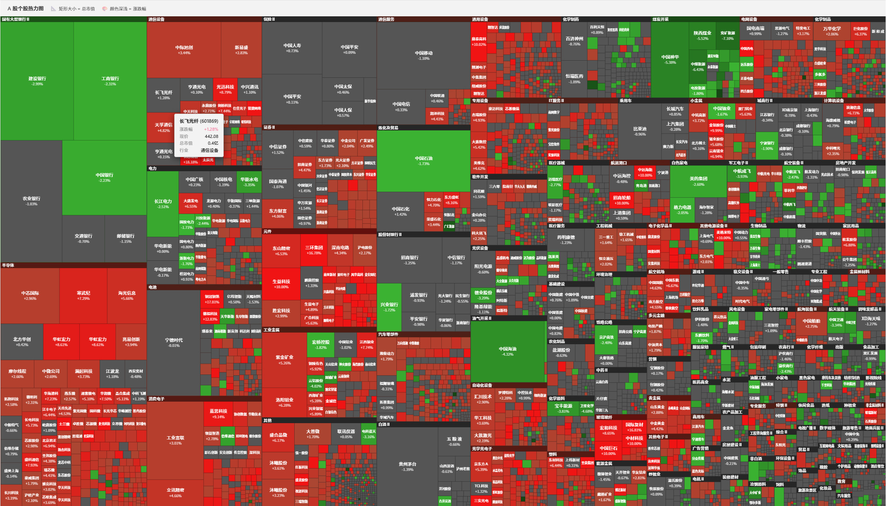
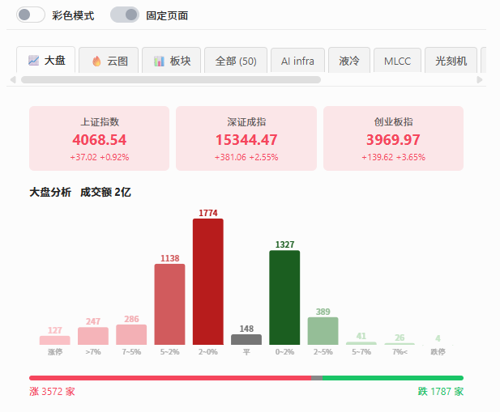
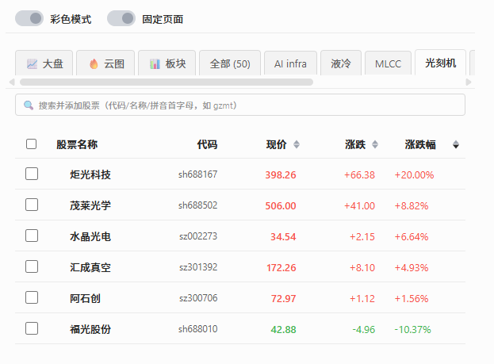
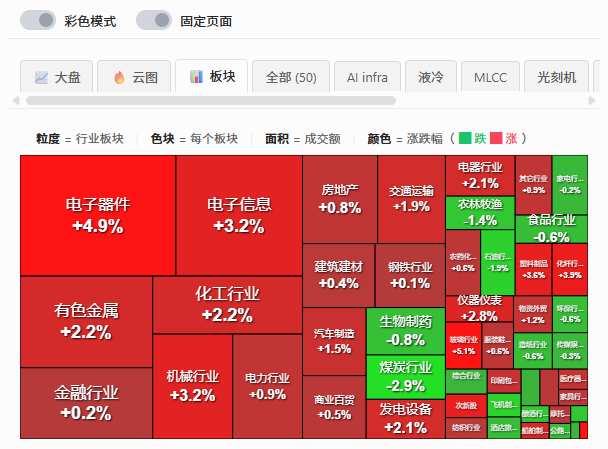
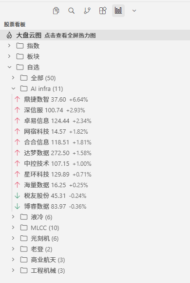

# CodeTrader - 股票监控插件

在编码的同时实时掌握 A 股动态。状态栏滚动行情、侧边栏分组看板、详情面板深度分析，以及——5000+ 只个股的**全市场热力图**。

## 功能亮点

- 🔥 **全 A 股热力图** — 5000+ 只个股热力图布局，面积=市值，颜色=涨跌
- 📈 **大盘分析** — 指数卡片 + 涨跌分布柱状图 + 涨跌家数，板块自动识别
- 📁 **分组管理** — 自定义分组。支持股票全称、代码、首字母缩写搜索添加、批量操作
- 🏭 **板块热榜** — 全行业按成交额排序，一眼识别热点赛道
- 📊 **侧边栏看板** — 分组折叠、红绿箭头、一键打开云图
- ⚡ **智能缓存** — 切 tab 瞬间展示，后台静默更新

---

### 🔥 全 A 股热力图



5000+ 只个股按行业 Treemap 布局。矩形面积 = 总市值，颜色 = 涨跌幅。大盘冷暖，一眼便知。全屏模式铺满窗口，hover 查看个股详情。

### 📈 大盘分析



三大指数卡片 + 涨跌分布柱状图 + 涨跌家数横条。柱状图按数量动态着色。ST / 主板 / 科创板 / 创业板 / 北交所自动识别涨跌停阈值。

### 📁 详情面板 & 分组管理



自定义分组（光伏、半导体、消费电子…），tab 切换互不干扰。拼音首字母搜索添加股票，批量勾选移除。彩色模式 / 固定页面 / 列头排序，分组信息实时同步侧边栏。重点个股手动置顶，

### 🏭 板块热榜



按成交额排序的全行业板块列表。颜色深浅 = 涨跌幅，一眼识别今日热点赛道。

### 📊 侧边栏看板



指数 + 板块 + 分组自选，一键折叠展开。涨跌红绿箭头，5 秒刷新。「大盘云图」入口直达全屏热力图。

### 更多特性

- **📟 状态栏实时行情** — 底部状态栏滚动显示自选股现价和涨跌幅。鼠标悬停弹 tooltip 汇总全部持仓。盘中 5 秒自动刷新。
- **⚡ 智能缓存** — 切 tab 瞬间展示上次数据，后台静默拉取最新行情。收盘后缓存自动保留到次日开盘。
- **🔍 拼音搜索** — 输入拼音首字母即可匹配股票（如 `gzmt` → 贵州茅台），支持代码、名称混合搜索。

## 快速开始

1. 安装插件后，点击活动栏的 CodeTrader 图标，侧边栏展开股票看板
2. 底部状态栏实时显示自选股行情，**单击**打开详情面板
3. 详情面板中点击「📈 大盘」查看市场全景，「🔥 云图」打开全屏热力图
4. 使用 `Ctrl+Alt+S`（Mac: `Cmd+Alt+S`）切换状态栏显示/隐藏

## 详情面板

- **彩色模式** — 开启后红涨绿跌
- **固定页面** — 鼠标离开不自动关闭
- **列头排序** — 点击现价/涨跌/涨跌幅排序
- **分组管理** — 自定义分组，右键重命名/删除，拖拽排序
- **批量操作** — 勾选股票批量移除，分组内独立管理

## 使用技巧

### 创建分组
1. 详情面板点击 `+` 新建分组，输入名称
2. 在搜索框输入拼音首字母或名称，选中添加
3. 右键分组标签可重命名、添加股票或删除分组
4. 拖拽分组标签调整顺序

### 大盘分析
1. 详情面板切换到「📈 大盘」tab
2. 首次加载约需数秒拉取全市场数据，之后自动缓存秒出
3. 柱状图按数量动态着色，体积最大的柱子颜色最深

### 板块热榜
1. 详情面板切换到「📊 板块」tab
2. 按成交额降序排列，颜色深浅反映涨跌幅
3. 颜色越深涨跌越剧烈，快速定位今日活跃赛道

### 热力图
1. 详情面板「🔥 云图」tab 或侧边栏「大盘云图」均可打开
2. 矩形面积 = 总市值，颜色 = 涨跌幅（红涨绿跌）
3. 鼠标悬停显示个股详情
4. 右上角刷新按钮手动更新

## 支持的股票格式

- 代码：`sh600519`、`sz000001`、`bj430047`
- 名称：`贵州茅台`、`中国平安`
- 指数：`sh000001`（上证）、`sz399001`（深证成指）

## 配置选项

在 VS Code 设置中搜索 `codetrader`：

| 配置项 | 说明 |
|--------|------|
| `codetrader.stocks` | 自选股票列表 |
| `codetrader.stockGroups` | 股票分组（通过面板管理） |
| `codetrader.maxStatusBarItems` | 状态栏最大显示数量 |
| `codetrader.useShortName` | 是否显示简称 |
| `codetrader.enableMonitor` | 异动监控开关 |

## 安装

### 插件市场

- [Open VSX Registry](https://open-vsx.org/extension/7236202/codetrader)

在 Cursor / VS Code 扩展面板搜索 `CodeTrader` 安装。

### VSIX 本地安装

从 [Releases](https://github.com/maozyi/codetrader/releases) 下载 `.vsix`：

```bash
cursor --install-extension codetrader-x.x.x.vsix
```

或图形界面：扩展面板 → `···` → 从 VSIX 安装。

## 链接

- [GitHub](https://github.com/maozyi/codetrader)
- [问题反馈](https://github.com/maozyi/codetrader/issues)
- [开发文档](DEVELOPMENT.md)
- [更新日志](CHANGELOG.md)

## 开源协议

[MIT](LICENSE.txt)
